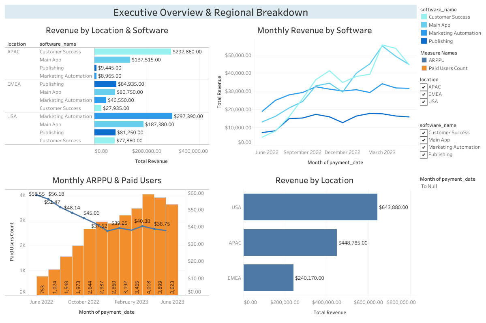
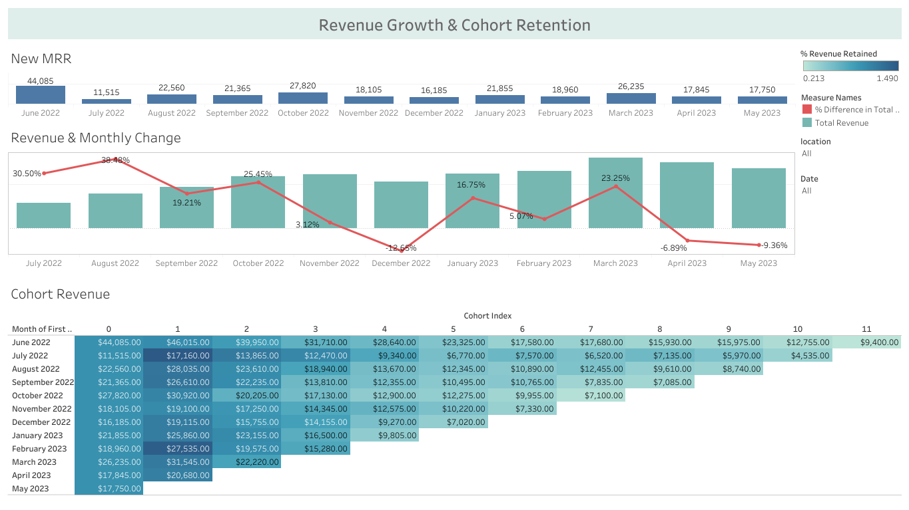

# 📊 SaaS Financial Performance & Cohort Retention Analytics

An interactive, end-to-end Tableau Business Intelligence project designed to evaluate recurring revenue dynamics, regional performance, pricing metrics, and long-term customer retention for a multi-product SaaS company.

🔗 **Interactive Tableau Dashboard:** [View on Tableau Public](https://public.tableau.com/app/profile/oleksandr.hordashevskyi/viz/Book14_2_17866371387550/Dashboard2)

---

## 📌 Business Overview & Problem Statement
SaaS leadership and product teams required visibility into core monetization metrics to evaluate business growth, regional demand, and subscription health across software offerings.

### Key Objectives:
* **Track Revenue Trajectory:** Assess Monthly Recurring Revenue (MRR) expansion, new customer contributions, and MoM growth velocity.
* **Segment Analysis:** Break down monetization across software products and geographical regions (APAC, EMEA, USA).
* **Unit Economics Monitoring:** Track Average Revenue Per Paid User (ARPPU) vs. Paid User scale.
* **Customer Retention Analysis:** Quantify retention decay and expansion patterns using a monthly cohort revenue matrix.

---

## 🖼️ Dashboard Architecture & Previews

### 1. Executive Overview & Regional Breakdown
Focuses on operational sales health, regional distribution, and subscription unit economics.



* **Key Metrics:** Paid Users Count, Total Revenue by Region, ARPPU Dynamics.
* **Key Dimensions:** Software Name (`Main App`, `Customer Success`, `Marketing Automation`, `Publishing`), Geographic Regions (`APAC`, `EMEA`, `USA`).

---

### 2. Revenue Growth & Cohort Retention
Deep-dives into growth consistency, acquisition momentum (New MRR), and lifecycle retention.



* **Key Metrics:** New MRR, MoM % Revenue Difference, Cohort Index (0–11 months).
* **Visual Mechanics:** Dynamic gradient shading based on % Revenue Retained relative to Cohort Month 0.

---

## 💡 Key Business Insights

1. **Regional Performance Discrepancy:**
   * **USA** represents the primary revenue engine ($643K+), driven heavily by *Marketing Automation* and *Main App*.
   * **APAC** exhibits strong traction ($448K+), with *Customer Success* being the dominant product line.
   * **EMEA** lags in overall volume ($240K+), indicating opportunities for revised go-to-market strategies.

2. **Unit Economics & ARPPU Trends:**
   * Paid user volume expanded rapidly from ~750 to over 3,600+ users.
   * Initial ARPPU stabilized around ~$38–$40 following early promotional pricing dilution, showing predictable average spend per subscriber.

3. **Growth Velocity & Seasonality:**
   * Peak MoM expansion occurred during Q3 (reaching +38.48% MoM growth in August).
   * Contractions observed in December (-12.65%) and late Spring highlight subscription churn points requiring targeted retention campaigns.

4. **Cohort Retention Patterns:**
   * Cohorts demonstrate initial expansion in Month 1 (up to 149% of base revenue), followed by a steady plateau, proving strong product stickiness before normal subscription lifecycle churn.

---

## 🛠️ Technical Stack & Tableau Skills Applied

* **BI Tool:** Tableau Public / Desktop
* **Advanced Calculations:**
  * **LOD Expressions:** `{FIXED [User ID] : MIN([Payment Date])}` for cohort assignment and New MRR identification.
  * **Table Calculations:** `LOOKUP()`, `% Difference in Total Revenue` for dynamic MoM growth rates.
  * **Aggregations & Metrics:** Dynamic ARPPU (`SUM(Revenue) / COUNTD(User ID)`), Dual-Axis synchronizations.
* **Data Visualizations:** Clustered Bar Charts, Multi-Line Series, Dual-Axis combo charts, Matrix Heatmaps with dynamic gradient coloring.
* **Interactive UI/UX:** Cross-sheet global filtering (Date Range, Region, Product), optimized container layouts, and decluttered dashboard headers.

---

## 📂 Project Structure
```text
├── datasets/
│   └── saas_revenue_data.csv       # Source transaction data
├── images/
│   ├── executive_overview.png      # High-res screenshot of Dashboard 1
│   └── cohort_retention.png        # High-res screenshot of Dashboard 2
└── README.md                       # Documentation and business summary
